# 408知识点依赖图

> 建议按照依赖顺序学习，先掌握前置知识再学习后续内容

---

## 📘 数据结构学习路径

### 阶段1：基础（线性结构）

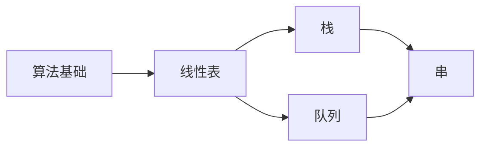

**学习顺序**：
1. [[数据结构/00-算法基础/时间复杂度]] - 所有算法的基础
2. [[2023年第01题-顺序表]] - 最基本的数据结构
3. [[数据结构/01-线性表/单链表基础]] - 链式存储基础
4. [[数据结构/02-栈队列串/栈的应用]] - 递归、表达式求值
5. [[数据结构/02-栈队列串/队列应用]] - 广度优先遍历的基础
6. [[数据结构/02-栈队列串/KMP算法]] - 需要理解线性表和数组

### 阶段2：树形结构

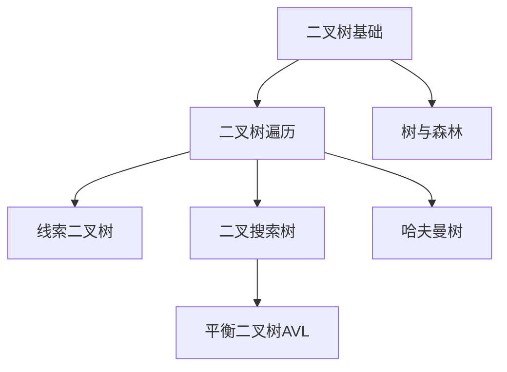

**学习顺序**：
1. [[数据结构/03-树与二叉树/二叉树基础]] - 前置：递归概念
2. [[数据结构/03-树与二叉树/二叉树遍历]] - 前置：栈和队列
3. [[2024年第07题-二叉搜索树]] - 前置：二叉树遍历
4. [[数据结构/03-树与二叉树/平衡二叉树]] - 前置：二叉搜索树
5. [[数据结构/03-树与二叉树/哈夫曼树]] - 前置：二叉树性质

**前置依赖**：
- 学习**线索二叉树**前需要掌握：[[数据结构/03-树与二叉树/二叉树遍历]]
- 学习**AVL树**前需要掌握：[[2024年第07题-二叉搜索树]]
- 学习**树与森林**前需要掌握：[[数据结构/03-树与二叉树/二叉树遍历]]

### 阶段3：图结构

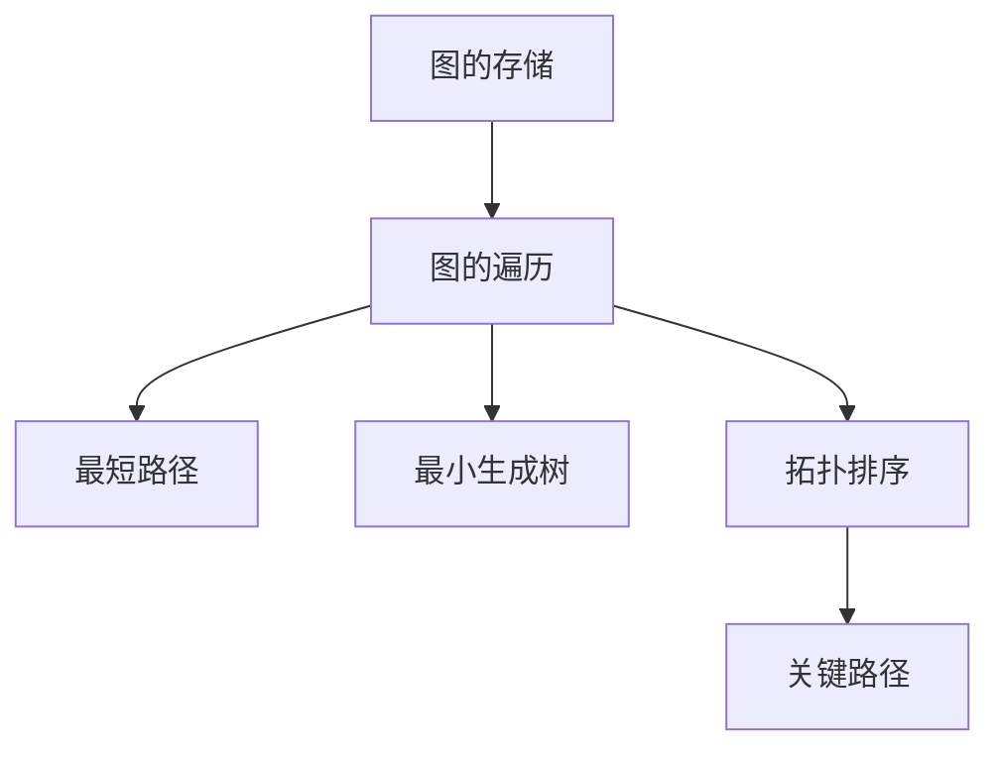

**学习顺序**：
1. [[数据结构/04-图/图的存储结构]] - 前置：线性表
2. [[数据结构/04-图/图的遍历]] - 前置：栈和队列（DFS和BFS）
3. [[2023年第06题-最短路径]] - 前置：图的遍历
4. [[数据结构/04-图/最小生成树]] - 前置：图的存储
5. [[数据结构/04-图/拓扑排序]] - 前置：图的遍历、栈
6. [[数据结构/04-图/关键路径]] - 前置：拓扑排序

**前置依赖**：
- 学习**图的遍历**前需要掌握：[[数据结构/02-栈队列串/栈的应用]]、[[数据结构/02-栈队列串/队列应用]]
- 学习**最短路径**前需要掌握：[[数据结构/04-图/图的遍历]]
- 学习**关键路径**前需要掌握：[[数据结构/04-图/拓扑排序]]

### 阶段4：查找与排序

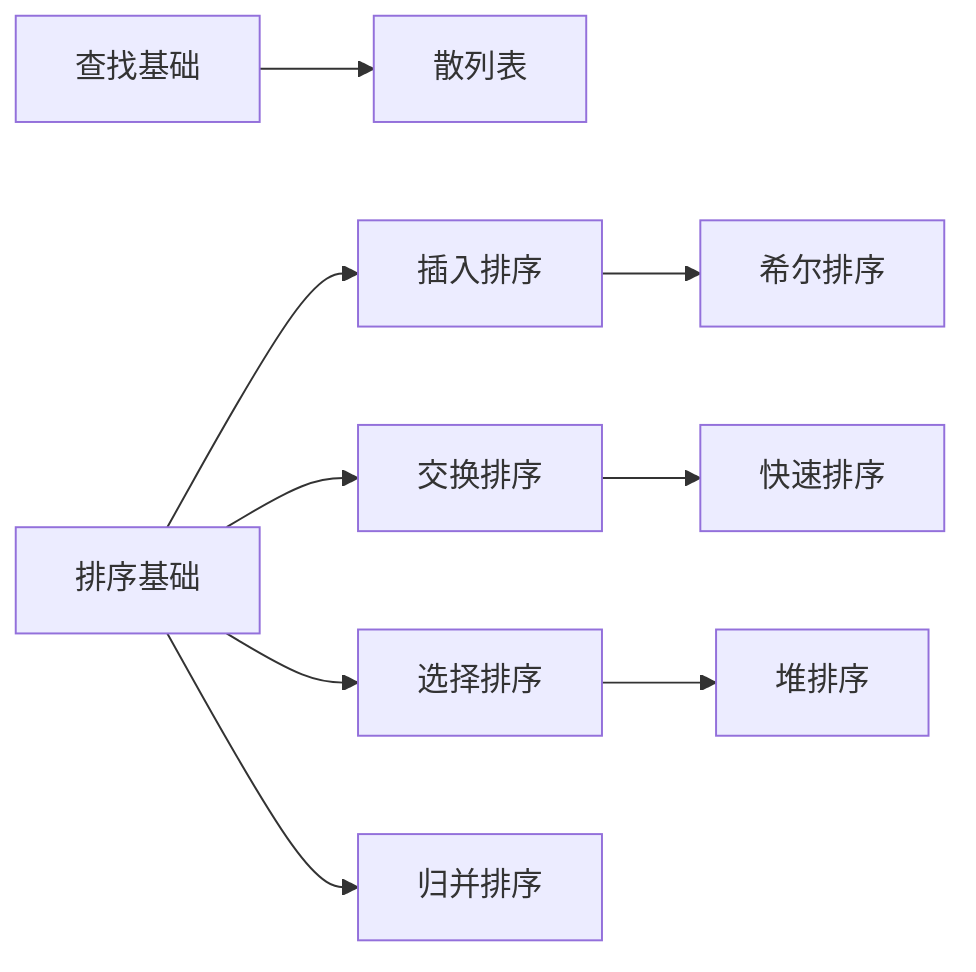

**学习顺序**：
1. [[数据结构/05-查找/顺序查找]] - 最基础
2. [[2023年第08题-折半查找]] - 前置：顺序表
3. [[数据结构/05-查找/散列表]] - 前置：链表、数组
4. [[数据结构/06-排序/插入排序]] - 最基础的排序
5. [[2023年第11题-快速排序]] - 前置：递归思想
6. [[2022年第10题-归并排序]] - 前置：递归思想
7. [[2024年第09题-堆排序]] - 前置：完全二叉树

**前置依赖**：
- 学习**快速排序**前需要掌握：递归思想、分治策略
- 学习**堆排序**前需要掌握：[[数据结构/03-树与二叉树/二叉树基础]]（完全二叉树）
- 学习**外部排序**前需要掌握：[[2022年第10题-归并排序]]

---

## 💻 计算机组成原理学习路径

### 阶段1：数据表示

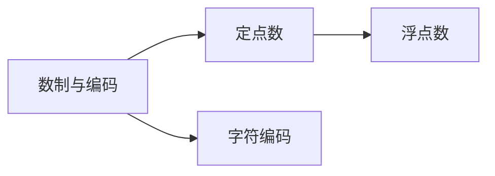

**学习顺序**：
1. [[计算机组成原理/01-数据的表示与运算/数制与编码]]
2. [[计算机组成原理/01-数据的表示与运算/定点数]]
3. [[计算机组成原理/01-数据的表示与运算/浮点数]]

### 阶段2：存储系统

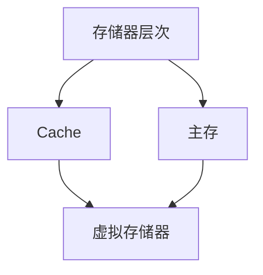

**学习顺序**：
1. [[计算机组成原理/02-存储系统/存储器层次结构]]
2. [[计算机组成原理/02-存储系统/Cache基本原理]]
3. [[计算机组成原理/02-存储系统/Cache映射方式]] - 前置：Cache基本原理
4. [[计算机组成原理/02-存储系统/页式存储]] - 前置：存储器基础
5. [[计算机组成原理/02-存储系统/虚拟存储器]] - 前置：Cache、页式存储

**前置依赖**：
- 学习**虚拟存储器**前需要掌握：[[计算机组成原理/02-存储系统/Cache基本原理]]、[[计算机组成原理/02-存储系统/页式存储]]

### 阶段3：指令系统与流水线

**学习顺序**：
1. [[计算机组成原理/03-指令系统/指令格式]]
2. [[计算机组成原理/03-指令系统/寻址方式]]
3. [[计算机组成原理/04-中央处理器/指令流水线]]
4. [[2023年第19题-流水线冒险]] - 前置：指令流水线

---

## 🖥️ 操作系统学习路径

### 阶段1：基础概念

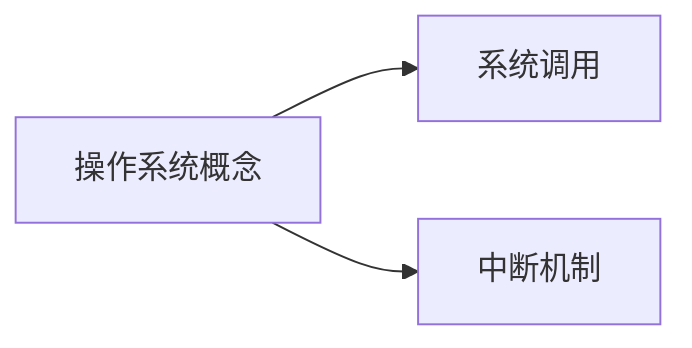

**学习顺序**：
1. [[操作系统/01-操作系统概述/操作系统概念]]
2. [[2022年第31题-系统调用]]

### 阶段2：进程管理

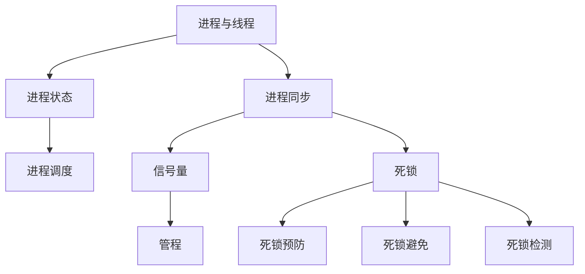

**学习顺序**：
1. [[2021年第29题-进程与线程]] - 最基础
2. [[操作系统/02-进程管理/进程状态]] - 前置：进程概念
3. [[操作系统/02-进程管理/进程调度]] - 前置：进程状态
4. [[操作系统/02-进程管理/进程同步]] - 前置：进程概念
5. [[操作系统/02-进程管理/信号量]] - 前置：进程同步
6. [[操作系统/02-进程管理/管程]] - 前置：信号量
7. [[操作系统/02-进程管理/死锁]] - 前置：进程同步

**前置依赖**：
- 学习**信号量**前需要掌握：[[操作系统/02-进程管理/进程同步]]
- 学习**死锁**前需要掌握：[[操作系统/02-进程管理/进程同步]]、[[操作系统/02-进程管理/信号量]]
- 学习**银行家算法**前需要掌握：[[操作系统/02-进程管理/死锁]]

### 阶段3：内存管理

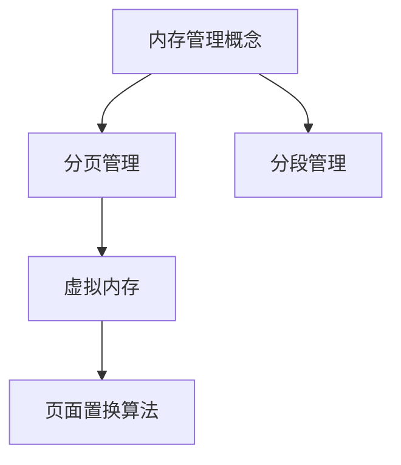

**学习顺序**：
1. [[操作系统/03-内存管理/内存管理概念]]
2. [[操作系统/03-内存管理/分页管理]]
3. [[2023年第28题-虚拟内存]] - 前置：分页管理
4. [[操作系统/03-内存管理/页面置换算法]] - 前置：虚拟内存

**前置依赖**：
- 学习**虚拟内存**前需要掌握：[[操作系统/03-内存管理/分页管理]]、[[计算机组成原理/02-存储系统/Cache基本原理]]
- 学习**页面置换算法**前需要掌握：[[2023年第28题-虚拟内存]]

### 阶段4：文件管理

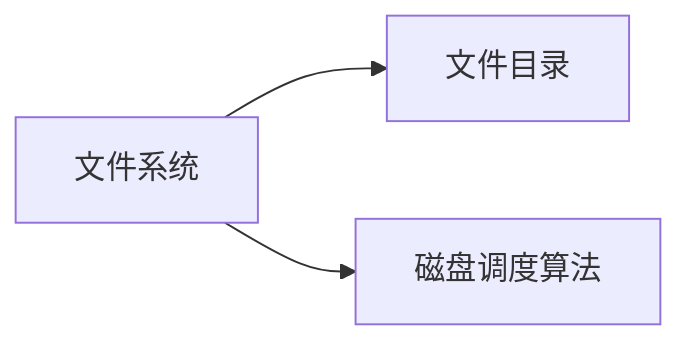

**学习顺序**：
1. [[操作系统/04-文件管理/文件系统]]
2. [[操作系统/04-文件管理/磁盘调度算法]]

---

## 🌐 计算机网络学习路径

### 阶段1：体系结构

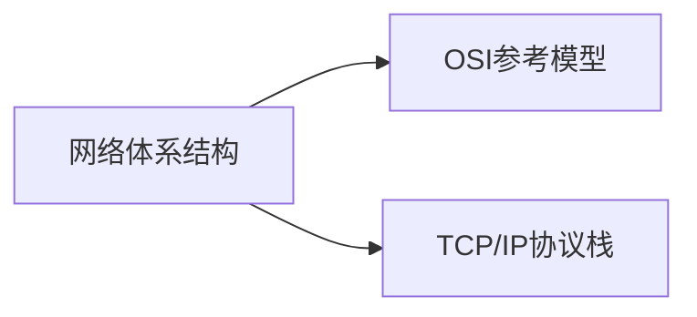

**学习顺序**：
1. [[2010年第33题-网络体系结构]]
2. [[计算机网络/01-计算机网络体系结构/OSI参考模型]]

### 阶段2：数据链路层

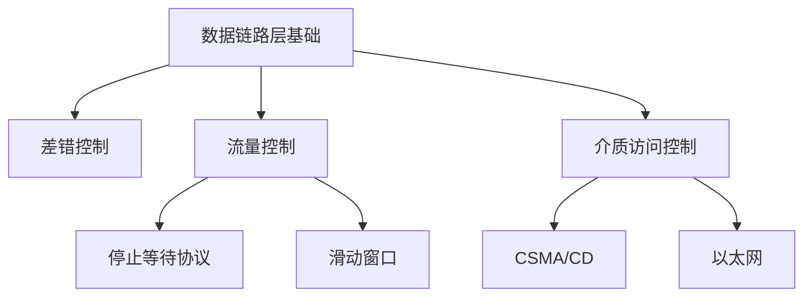

**学习顺序**：
1. [[计算机网络/03-数据链路层/数据链路层基础]]
2. [[计算机网络/03-数据链路层/CSMA协议]]
3. [[计算机网络/03-数据链路层/以太网]] - 前置：CSMA/CD
4. [[计算机网络/03-数据链路层/滑动窗口]]

### 阶段3：网络层

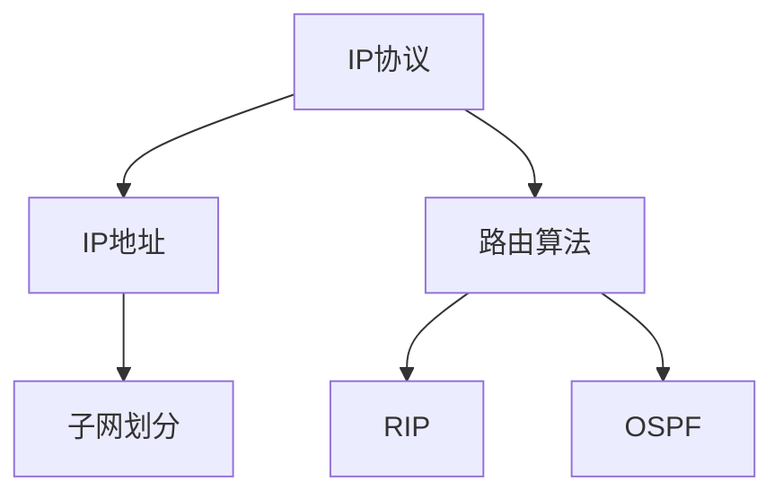

**学习顺序**：
1. [[计算机网络/04-网络层/IP协议]]
2. [[2018年第38题-IP地址]]
3. [[2023年第39题-子网划分]] - 前置：IP地址
4. [[计算机网络/04-网络层/路由算法]]
5. [[计算机网络/04-网络层/RIP]] - 前置：路由算法
6. [[计算机网络/04-网络层/OSPF]] - 前置：路由算法

### 阶段4：传输层

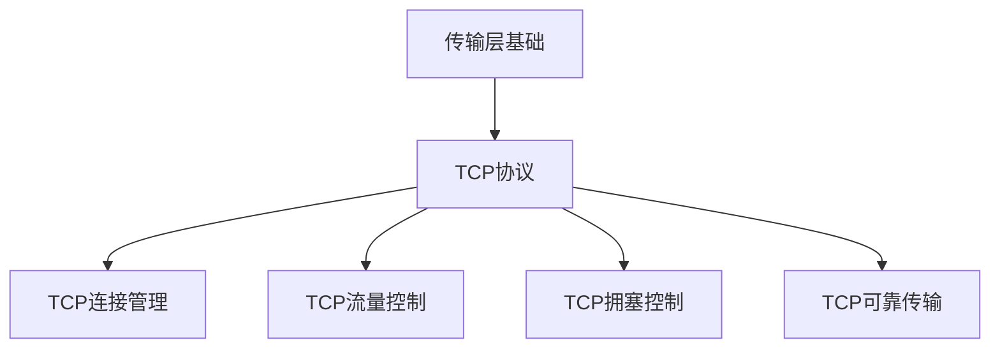

**学习顺序**：
1. [[计算机网络/05-传输层/传输层基础]]
2. [[计算机网络/05-传输层/TCP协议]]
3. [[计算机网络/05-传输层/TCP连接管理]] - 前置：TCP协议
4. [[计算机网络/05-传输层/TCP流量控制]] - 前置：TCP协议
5. [[计算机网络/05-传输层/TCP可靠传输]] - 前置：TCP协议、数据链路层滑动窗口
6. [[2022年第38题-TCP拥塞控制]] - 前置：TCP流量控制

**前置依赖**：
- 学习**TCP可靠传输**前需要掌握：[[计算机网络/03-数据链路层/滑动窗口]]
- 学习**TCP拥塞控制**前需要掌握：[[计算机网络/05-传输层/TCP流量控制]]

### 阶段5：应用层

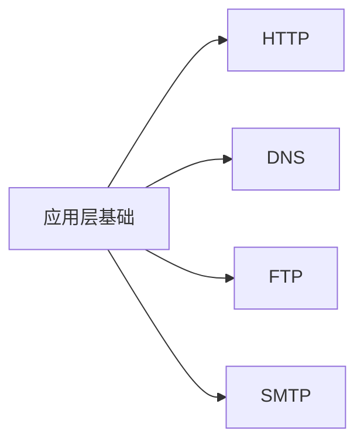

**学习顺序**：
1. [[计算机网络/06-应用层/应用层基础]]
2. [[计算机网络/06-应用层/HTTP]]
3. [[计算机网络/06-应用层/DNS]]

---

## 📋 跨学科依赖

### 操作系统 ↔ 计算机组成

- **虚拟内存**依赖：
  - [[2023年第28题-虚拟内存]]
  - [[计算机组成原理/02-存储系统/页式存储]]
  - [[计算机组成原理/02-存储系统/Cache基本原理]]

- **中断与I/O**依赖：
  - [[操作系统/01-操作系统概述/中断机制]]
  - [[计算机组成原理/06-输入输出系统/中断方式]]

### 数据结构 ↔ 操作系统

- **进程调度**依赖：
  - [[操作系统/02-进程管理/进程调度]]
  - [[数据结构/02-栈队列串/队列应用]]（就绪队列）

- **文件系统**依赖：
  - [[操作系统/04-文件管理/文件系统]]
  - [[数据结构/03-树与二叉树/树的遍历]]（目录树）

### 计算机网络 ↔ 数据结构

- **路由算法**依赖：
  - [[计算机网络/04-网络层/路由算法]]
  - [[2023年第06题-最短路径]]

---

## 🎯 建议学习策略

### 零基础入门顺序
1. **数据结构基础** → 线性表、栈队列
2. **计算机组成基础** → 数据表示、存储器
3. **操作系统基础** → 进程管理、内存管理
4. **计算机网络基础** → 体系结构、各层协议

### 408考研复习顺序
1. **第一轮**（3个月）：按学科顺序通读，掌握基础概念
2. **第二轮**（2个月）：按依赖关系深入学习，攻克难点
3. **第三轮**（2个月）：刷真题，查漏补缺
4. **第四轮**（1个月）：高频考点强化，模拟考试

### 每日学习建议
- **上午**：新知识学习（按依赖图顺序）
- **下午**：真题练习（巩固已学知识点）
- **晚上**：总结复习（建立知识点之间的联系）

---

**快速跳转**：
- [[知识库/README|返回知识库导航]]
- [[408考研题库 Index|返回题库导航]]

## 解题思路

### 第一步：理解题目核心
分析题目考查的核心知识点

### 第二步：逐项分析
逐一分析各选项，用✅❌标记正确与否

### 第三步：确认答案
综合分析得出答案

## 易错点分析

### 易错点1：常见误区
❌ 错误理解：
✅ 正确理解：

### 易错点2：概念对比
| 概念A | 概念B | 区别 |
|-------|-------|------|
| 说明 | 说明 | 区别点 |