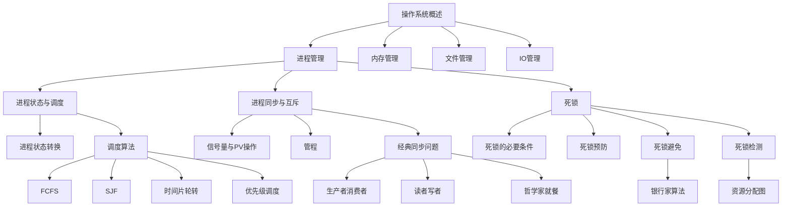

# 面向AI的408知识库架构优化方案

> **目标**：将现有"人类友好型"知识库升级为"AI友好型"知识库  
> **适用场景**：RAG检索、Claude Code、Cherry Studio、Dify、OpenWebUI  
> **预计工作量**：核心功能 40-60小时 / 完整功能 100-120小时

---

## 📊 现状评估

### ✅ 已有优势
- 16年真题完整（2009-2024，753题）
- 三维组织：时间维度（年份）、知识维度（章节）、题型维度（选择/综合）
- 原子化设计：每道题独立文件
- 图文分离：images文件夹集中管理

### ⚠️ AI能力短板
- **缺少结构化Metadata**：年份、难度、考频无法筛选
- **缺少知识点定义库**：AI只见题目，不懂概念
- **缺少解题思路**：只有答案，无推理过程
- **缺少QA语料**：问答能力受限，召回效果差
- **图片语义缺失**：配图题无法被有效检索

---

## 🎯 优化目标

### 让AI能够
1. **精准检索**："给我2020年后OS进程管理难度3星以上的题"
2. **概念解释**："什么是银行家算法？"
3. **讲题析题**："为什么这道题选B不选C？"
4. **自然问答**："进程和线程的区别是什么？"
5. **统计分析**："死锁这个知识点16年考了多少次？"

6. **关联推荐**："学完进程调度后应该看哪些题？"
7. **生成复习计划**："给我操作系统的冲刺复习路线"

---

## 🏗️ 架构设计

### 最终目录结构

```
408真题知识库/
│
├── 📑 408考研题库 Index.md
├── 📑 408图片索引.md
├── 📁 408答案/
├── 📁 408题库/
│   ├── 01-真题原卷/
│   ├── 02-按知识点-选择题/
│   ├── 03-按知识点-综合题/
│   ├── 04-索引视图/
│   └── images/
│
├── 📁 AI-知识点原子库/          ← 新增
│   ├── 数据结构/
│   ├── 计算机组成原理/
│   ├── 操作系统/
│   └── 计算机网络/
│
├── 📁 AI-QA问答库/              ← 新增
│   ├── 数据结构-QA.md
│   ├── 计算机组成原理-QA.md
│   ├── 操作系统-QA.md
│   └── 计算机网络-QA.md
│
├── 📁 AI-解题思路库/            ← 新增
│   ├── 数据结构/
│   ├── 计算机组成原理/
│   ├── 操作系统/
│   └── 计算机网络/
│
├── 📁 AI-统计分析/              ← 新增
│   ├── 考频统计.md
│   ├── 难度分布.md
│   ├── 知识点热力图.md
│   └── 年份趋势分析.md
│
├── 📁 AI-易错点库/              ← 新增
│   ├── 数据结构易错点.md
│   ├── 组成原理易错点.md
│   ├── 操作系统易错点.md
│   └── 计算机网络易错点.md
│
├── 📁 AI-教材映射/              ← 新增
│   ├── 王道映射表.md
│   └── 天勤映射表.md
│
├── 📁 AI-知识图谱/              ← 新增
│   ├── 数据结构知识图谱.md
│   ├── 组成原理知识图谱.md
│   ├── 操作系统知识图谱.md
│   └── 计算机网络知识图谱.md
│
└── 📁 AI-冲刺总结/              ← 新增
    ├── 考前速查手册.md
    ├── 高频考点TOP50.md
    └── 模拟冲刺计划.md
```

---

## 📋 功能详细设计

### ⭐⭐⭐⭐⭐ 优先级1：核心四件套（必须实现）

#### 功能1：统一Metadata层

**目标**：为所有题目补充结构化元数据，支持精准筛选

**实现内容**：
```yaml
---
# 基础信息
year: 2024                    # 年份
question_id: "2024-01"        # 题目唯一ID
subject: 数据结构              # 科目
chapter: 栈和队列              # 章节
knowledge_point: 栈的应用      # 知识点
type: 选择题                   # 题型（选择题/综合题）

# 难度与考频
difficulty: 3                 # 难度（1-5星）
frequency: 高频                # 考频（高频/中频/低频）
exam_count: 8                 # 历年考察次数

# 关联信息
related_questions:            # 相关题目
  - "2020-05"
  - "2018-12"
related_knowledge:            # 相关知识点
  - 队列应用
  - 递归与栈
tags:                         # 标签
  - 数据结构
  - 栈
  - 应用题

# 教材映射
wangdao_page: "3.2.1"        # 王道书页码
tianqin_page: "2.3"          # 天勤书页码

# 图片相关
has_image: true              # 是否含配图
image_path: "images/2024/Q01.png"
---
```

**工作量**：
- 选择题：约640题 × 5分钟 = 53小时
- 综合题：约113题 × 8分钟 = 15小时
- **小计：68小时**

**验证标准**：
- [ ] 所有题目都有完整frontmatter
- [ ] 能执行查询："difficulty > 3 AND subject = '操作系统' AND year > 2020"
- [ ] 标签体系统一（无重复/冲突）

---

#### 功能2：知识点原子库

**目标**：为每个408核心知识点创建独立定义文件

**文件结构示例**：
```markdown
# 银行家算法

## 定义
银行家算法是避免死锁的一种动态策略，通过在资源分配前进行安全性检查，确保系统始终处于安全状态。

## 核心概念
- **可用资源向量 Available[m]**：系统当前剩余资源数
- **最大需求矩阵 Max[n][m]**：每个进程对每类资源的最大需求
- **已分配矩阵 Allocation[n][m]**：当前已分配给各进程的资源数
- **需求矩阵 Need[n][m]**：Need = Max - Allocation

## 算法流程
1. 检查请求是否合法（Request ≤ Need）
2. 检查资源是否足够（Request ≤ Available）
3. 试探性分配资源
4. 执行安全性检查
5. 若安全则正式分配，否则回滚

## 关键公式
- Need[i] = Max[i] - Allocation[i]
- Available = Available - Request[i] （试分配）
- 安全序列判定：存在序列使每个进程都能完成

## 易混淆点
- **银行家算法 vs 安全性检查**：银行家算法包含安全性检查，但不等价
- **死锁避免 vs 死锁预防**：避免是动态策略，预防是静态破坏必要条件
- **安全状态 ≠ 无死锁**：不安全状态可能死锁，也可能不死锁

## 关联知识点
- [[死锁的四个必要条件]]
- [[死锁预防策略]]
- [[资源分配图]]

## 真题考点
- 给定状态判断是否安全（高频）
- 计算安全序列个数（中频）
- 判断请求能否立即满足（高频）

## 历年真题
- [[2012年第28题]]
- [[2015年第29题]]
- [[2019年第30题]]
```

**需要创建的知识点清单**：

**数据结构（约50个）**：
- 算法基础：时间复杂度、空间复杂度、递归
- 线性表：顺序表、链表、双向链表、循环链表
- 栈和队列：栈的应用、队列应用、递归与栈、循环队列
- 树：二叉树遍历、完全二叉树、AVL树、红黑树、B树、B+树、哈夫曼树、线索二叉树
- 图：DFS、BFS、最短路径、最小生成树、拓扑排序、关键路径
- 查找：二分查找、散列表、哈希冲突
- 排序：快排、归并、堆排序、基数排序、排序算法对比

**计算机组成原理（约60个）**：
- 数据表示：原码补码反码、定点数浮点数、IEEE754
- 存储系统：Cache、虚拟存储、页式存储、段式存储、段页式、局部性原理
- 指令系统：寻址方式、CISC vs RISC、指令格式
- CPU：数据通路、控制器、微程序控制、硬布线控制
- 流水线：流水线冲突、流水线加速比、超标量
- 总线：总线仲裁、总线带宽
- IO：DMA、中断、通道

**操作系统（约55个）**：
- 概述：系统调用、中断、态转换
- 进程管理：进程状态、进程调度、死锁、PV操作、管程、信号量
- 内存管理：分页、分段、页面置换算法、TLB、工作集
- 文件管理：文件索引、磁盘调度、RAID
- IO管理：缓冲、SPOOLing

**计算机网络（约45个）**：
- 物理层：信道容量、奈奎斯特定理、香农定理
- 数据链路层：CSMA/CD、滑动窗口、海明码、CRC
- 网络层：IP地址、子网划分、路由算法、NAT、ARP
- 传输层：TCP、UDP、拥塞控制、流量控制
- 应用层：DNS、HTTP、SMTP、FTP

**工作量**：
- 约210个知识点 × 30分钟 = 105小时
- **小计：105小时**

**验证标准**：
- [ ] 每个知识点包含：定义、公式、易混点、关联知识、真题链接
- [ ] AI能回答："什么是银行家算法？"并给出完整解释
- [ ] 知识点间有双向链接

---

#### 功能3：解题思路库

**目标**：为每道题补充完整的解题推理过程

**文件结构示例**：
```markdown
# 2019年第30题 - 死锁判断

## 题目
下列关于死锁的叙述中，正确的是（）。
I. 可以通过剥夺进程资源解除死锁
II. 死锁的预防方法能确保系统不发生死锁
III. 银行家算法可以判断系统是否处于死锁状态
IV. 当系统出现死锁时，必然有两个或两个以上的进程处于阻塞态

A. 仅I、II
B. 仅I、II、IV
C. 仅II、III、IV
D. I、II、III、IV

## 标准答案
B

## 解题思路

### 第一步：逐项分析

**I. 可以通过剥夺进程资源解除死锁 ✓**
- 死锁解除的四种方法之一：资源剥夺法
- 从死锁进程中强制剥夺资源分配给其他进程
- 注意：只适用于状态易于保存和恢复的资源（如内存、处理器）

**II. 死锁的预防方法能确保系统不发生死锁 ✓**
- 死锁预防：破坏四个必要条件之一
- 静态策略，在资源分配前就杜绝死锁可能
- 例如：破坏请求保持条件（一次性分配所有资源）

**III. 银行家算法可以判断系统是否处于死锁状态 ✗**
- **关键错误**：银行家算法属于死锁**避免**，不是死锁**检测**
- 作用：在分配资源前进行安全性检查，预防死锁发生
- 判断是否死锁应该用死锁检测算法（资源分配图化简）

**IV. 当系统出现死锁时，必然有两个或两个以上的进程处于阻塞态 ✓**
- 死锁定义：多个进程互相等待对方释放资源而无限期阻塞
- 至少需要2个进程才能形成循环等待
- 单个进程不可能死锁（无法自己等待自己）

### 第二步：排除干扰项

**为什么不选A**：缺少IV，但IV是正确的  
**为什么不选C**：包含III，但III错误  
**为什么不选D**：包含III，但III错误

### 第三步：确认答案

正确的有：I、II、IV → 答案B

## 易错点

**陷阱1：混淆死锁避免与死锁检测**
- 避免（银行家算法）：事前预防，确保不进入不安全状态
- 检测（资源分配图）：事后诊断，判断当前是否死锁

**陷阱2：死锁预防 vs 避免**
- 预防：静态策略，破坏必要条件，资源利用率低
- 避免：动态策略，运行时判断，灵活但开销大

## 关联知识点
- [[死锁的四个必要条件]]
- [[银行家算法]]
- [[死锁检测算法]]
- [[资源分配图]]

## 相似题目
- [[2015年第29题]] - 银行家算法安全序列
- [[2012年第28题]] - 死锁预防策略
```

**工作量**：
- 选择题：约640题 × 15分钟 = 160小时
- 综合题：约113题 × 30分钟 = 56小时
- **小计：216小时**（可分批进行，优先高频考点）

**最小可行方案**：
- 仅处理高频知识点的代表题（约150题）
- **优化后：37.5小时**

**验证标准**：
- [ ] 每道题包含：逐项分析、排除法、易错点、关联知识
- [ ] AI能回答："为什么这道题选B不选C？"
- [ ] 解题思路清晰，非专业背景也能看懂

---

#### 功能4：QA问答库

**目标**：构建自然语言问答语料，提升RAG召回效果

**文件结构示例**：
```markdown
# 操作系统 QA问答库

## 进程管理

### Q: 进程和线程有什么区别？
**A**：
1. **资源分配单位**：进程是资源分配的基本单位，线程是CPU调度的基本单位
2. **地址空间**：进程有独立地址空间，线程共享进程地址空间
3. **开销**：进程切换开销大（需切换地址空间），线程切换开销小
4. **通信**：进程间通信需IPC机制，线程可直接访问共享变量
5. **崩溃影响**：一个进程崩溃不影响其他进程，一个线程崩溃可能导致整个进程终止

**关联真题**：[[2018年第26题]] [[2021年第27题]]

---

### Q: 什么是死锁？如何预防？
**A**：
**定义**：多个进程因互相等待对方持有的资源而无限期阻塞的状态。

**四个必要条件**：
1. 互斥条件：资源不能被共享
2. 请求保持条件：已持有资源的进程可继续请求新资源
3. 不可剥夺条件：资源只能主动释放
4. 循环等待条件：形成进程资源的环路

**预防方法（破坏必要条件）**：
- 破坏互斥：将资源改造为可共享（如SPOOLing技术）
- 破坏请求保持：一次性分配所有资源
- 破坏不可剥夺：允许强制剥夺资源
- 破坏循环等待：资源按序分配

**关联真题**：[[2019年第30题]] [[2015年第29题]]

---

### Q: 银行家算法的核心思想是什么？
**A**：
银行家算法是死锁**避免**策略，核心思想是：
1. 在分配资源前进行安全性检查
2. 只有确保分配后系统仍处于安全状态才实际分配
3. 安全状态：存在至少一个进程序列，使每个进程都能获得所需资源并完成

**算法步骤**：
1. 检查请求合法性（Request ≤ Need）
2. 检查资源可用性（Request ≤ Available）
3. 试探性分配
4. 安全性检查（寻找安全序列）
5. 若安全则正式分配，否则回滚

**常见误区**：
- ✗ 银行家算法不能检测死锁（它是避免死锁）
- ✓ 安全状态一定无死锁，不安全状态不一定死锁

**关联真题**：[[2012年第28题]] [[2015年第29题]]

---

### Q: 进程调度算法有哪些？各有什么特点？
**A**：

| 算法 | 特点 | 优点 | 缺点 | 是否抢占 |
|------|------|------|------|----------|
| FCFS | 先来先服务 | 公平、简单 | 平均等待时间长 | 非抢占 |
| SJF | 短作业优先 | 平均等待时间最短 | 长作业饥饿 | 非抢占 |
| 时间片轮转 | 固定时间片 | 响应时间快 | 上下文切换频繁 | 抢占 |
| 优先级调度 | 按优先级 | 灵活 | 低优先级饥饿 | 可抢占可非抢占 |
| 多级反馈队列 | 综合策略 | 兼顾响应时间和周转时间 | 实现复杂 | 抢占 |

**关联真题**：[[2020年第28题]] [[2018年第24题]]
```

**需要创建的QA数量**：
- 数据结构：80-100个QA
- 计算机组成原理：100-120个QA
- 操作系统：80-100个QA
- 计算机网络：70-90个QA
- **总计：约400个QA**

**工作量**：
- 400个QA × 10分钟 = 66小时
- **小计：66小时**

**最小可行方案**：
- 每个科目仅创建高频考点QA（50个/科目）
- **优化后：33小时**

**验证标准**：
- [ ] 覆盖所有核心知识点
- [ ] 问题表述自然（符合真实提问习惯）
- [ ] 答案结构化（定义-公式-对比-真题）
- [ ] AI能直接召回并回答

---

### ⭐⭐⭐⭐⭐ 优先级1总结

| 功能 | 工作量（完整） | 工作量（最小可行） | 产出 |
|------|----------------|---------------------|------|
| Metadata层 | 68小时 | 68小时（必须全做） | 753个题目的结构化元数据 |
| 知识点原子库 | 105小时 | 50小时（仅核心知识点100个） | 210个知识点定义 |
| 解题思路库 | 216小时 | 38小时（仅高频题150题） | 753道题的解题思路 |
| QA问答库 | 66小时 | 33小时（200个QA） | 400个QA对 |
| **合计** | **455小时** | **189小时** | 核心AI能力 |

**最小可行建议**：先完成Metadata层（68小时）+ 核心知识点（50小时）+ 高频题思路（38小时）+ 核心QA（33小时）= **189小时**

---

### ⭐⭐⭐⭐ 优先级2：价值提升层（建议实现）

#### 功能5：考频统计分析

**目标**：统计16年真题的知识点分布，识别高频考点

**文件结构示例**：
```markdown
# 408考频统计报告

## 数据结构考频TOP20

| 排名 | 知识点 | 考察次数 | 年份分布 | 题型 | 平均难度 |
|------|--------|----------|----------|------|----------|
| 1 | 栈的应用 | 15次 | 2009-2024（连续） | 选择题为主 | ⭐⭐⭐ |
| 2 | 二叉树遍历 | 14次 | 2009-2024（缺2020） | 选择+综合 | ⭐⭐⭐⭐ |
| 3 | 图的最短路径 | 12次 | 2010-2024（隔年） | 综合题为主 | ⭐⭐⭐⭐⭐ |
| 4 | 排序算法对比 | 11次 | 全年份 | 选择题 | ⭐⭐ |
| 5 | AVL树旋转 | 10次 | 2012-2024 | 选择+综合 | ⭐⭐⭐⭐ |
| ... | ... | ... | ... | ... | ... |

## 操作系统考频TOP20

| 排名 | 知识点 | 考察次数 | 年份分布 | 题型 | 平均难度 |
|------|--------|----------|----------|------|----------|
| 1 | 死锁判断 | 13次 | 2009-2024（缺2011,2016） | 选择题为主 | ⭐⭐⭐ |
| 2 | 页面置换算法 | 12次 | 全年份 | 综合题为主 | ⭐⭐⭐⭐ |
| 3 | 进程调度 | 11次 | 2009-2023 | 选择+综合 | ⭐⭐⭐ |
| ... | ... | ... | ... | ... | ... |

## 年份趋势分析

### 2020年后新增考点
- 容器化技术（2023年）
- 多核处理器（2021年）
- 软件定义网络（2022年）

### 淡化的考点
- 8086汇编（2015年后未考）
- 令牌环网（2012年后未考）

## 冷门考点清单
- 斐波那契堆（仅1次，2018年）
- B*树（仅2次，2010/2014年）
```

**实现内容**：
1. 知识点出现频率统计
2. 年份趋势热力图
3. 题型分布（选择/综合）
4. 难度分布统计
5. 冷热考点划分

**工作量**：
- 数据清洗与统计：15小时
- 可视化图表生成：5小时
- **小计：20小时**

**验证标准**：
- [ ] 能回答："死锁这个知识点16年考了多少次？"
- [ ] 能生成考频热力图
- [ ] 能识别新增/淡化考点

---

#### 功能6：易错点库

**目标**：整理408高频易混淆知识点

**文件结构示例**：
```markdown
# 操作系统易错点库

## 易错点1：死锁避免 vs 死锁预防 vs 死锁检测

### 核心区别

| 策略 | 时机 | 方法 | 代表算法 | 资源利用率 |
|------|------|------|----------|------------|
| 预防 | 事前静态 | 破坏必要条件 | 资源有序分配 | 低 |
| 避免 | 事中动态 | 安全性检查 | 银行家算法 | 中 |
| 检测 | 事后诊断 | 资源分配图 | 死锁检测算法 | 高 |

### 典型错误

**错误1**：认为银行家算法可以检测死锁
- ✗ 银行家算法属于**避免**策略，在分配前预防
- ✓ 死锁检测需要用资源分配图化简

**错误2**：认为安全状态 = 无死锁
- ✓ 安全状态一定无死锁
- ✗ 不安全状态不一定死锁（可能死锁，也可能不死锁）

### 关联真题
- [[2019年第30题]] - 直接考察三者区别
- [[2015年第29题]] - 银行家算法误用为检测

---

## 易错点2：进程 vs 线程

### 记忆技巧
**进程 = 资源老大哥**（拥有独立资源）
**线程 = 执行小弟**（共享进程资源）

### 易混淆点

| 对比项 | 进程 | 线程 | 记忆口诀 |
|--------|------|------|----------|
| 资源分配 | 基本单位 | 不是 | "进程管资源" |
| CPU调度 | 不是 | 基本单位 | "线程跑任务" |
| 地址空间 | 独立 | 共享 | "进程有房产" |
| 通信方式 | IPC机制 | 直接共享 | "线程室友，进程邻居" |
| 开销 | 大 | 小 | "搬家（进程）vs 换房间（线程）" |

### 陷阱题示例
**题**：以下哪个不是进程可以共享的？
A. 代码段  B. 全局变量  C. 栈  D. 打开文件表

**陷阱**：题目问的是"进程共享"，不是"线程共享"
- 进程间可通过共享内存共享代码段、全局变量
- 但栈是每个进程独立的（选C）

### 关联真题
- [[2018年第26题]]
- [[2021年第27题]]
```

**需要整理的易错点数量**：
- 数据结构：20个
- 计算机组成原理：25个
- 操作系统：20个
- 计算机网络：15个
- **总计：约80个易错点**

**工作量**：
- 80个易错点 × 20分钟 = 26小时
- **小计：26小时**

**验证标准**：
- [ ] 每个易错点包含：核心区别、典型错误、记忆技巧、陷阱题
- [ ] 覆盖历年真题中的高频混淆点
- [ ] AI能识别用户的易错理解并纠正

---

#### 功能7：教材映射层

**目标**：关联408真题与主流教材页码

**文件结构示例**：
```markdown
# 408真题 - 王道教材映射表

## 数据结构

| 知识点 | 王道章节 | 王道页码 | 真题列表 | 考频 |
|--------|----------|----------|----------|------|
| 栈的应用 | 3.1.3 | P85-92 | 2009-01, 2010-01, 2011-02... | 15次 |
| 队列应用 | 3.2.2 | P98-105 | 2009-01, 2013-02... | 8次 |
| AVL树 | 5.5.2 | P186-195 | 2012-05, 2015-04... | 10次 |
| 最短路径 | 6.4.3 | P238-250 | 2010-08, 2012-08... | 12次 |

## 操作系统

| 知识点 | 王道章节 | 王道页码 | 真题列表 | 考频 |
|--------|----------|----------|----------|------|
| 死锁 | 2.4 | P62-75 | 2009-24, 2012-28... | 13次 |
| 银行家算法 | 2.4.3 | P68-72 | 2012-28, 2015-29... | 8次 |
| 页面置换 | 3.3.3 | P98-110 | 2011-30, 2019-31... | 12次 |
```

**实现内容**：
1. 真题与王道教材的章节映射
2. 真题与天勤教材的章节映射（可选）
3. 每个知识点的教材页码范围
4. 考频与教材重点对应关系

**工作量**：
- 王道映射：30小时
- 天勤映射（可选）：20小时
- **小计：30-50小时**

**验证标准**：
- [ ] 每道真题都能找到对应教材位置
- [ ] AI能回答："这道题对应王道书哪一章？"
- [ ] 支持反向查询："王道P85-92讲了什么？有哪些真题？"

---

### ⭐⭐⭐⭐ 优先级2总结

| 功能 | 工作量 | 产出 | 提升效果 |
|------|--------|------|----------|
| 考频统计 | 20小时 | 知识点出现频率、年份趋势 | AI能分析高频考点 |
| 易错点库 | 26小时 | 80个易混淆知识点 | AI能识别并纠正错误理解 |
| 教材映射 | 30-50小时 | 真题-教材映射表 | 便于考生针对性复习 |
| **合计** | **76-96小时** | 统计分析+易错点+教材关联 | 显著提升实用价值 |

---

### ⭐⭐⭐ 优先级3：高级功能层（可选实现）

#### 功能8：图片语义索引

**目标**：为77道含配图题目补充语义标签，提升检索能力

**实现内容**：
```markdown
# 2024年第6题图片语义

**图片类型**：数据结构图示
**包含元素**：
- 二叉树结构（5个节点）
- 箭头指向关系
- 节点值：A, B, C, D, E

**语义标签**：
- #二叉树遍历
- #树结构图
- #前序遍历
- #中序遍历

**OCR文本**：
```
前序遍历：A B D C E
中序遍历：D B A E C
```

**视觉描述**：
树形结构，根节点A，左子树包含B和D，右子树包含C和E。箭头表示遍历顺序。

**关联知识点**：[[二叉树遍历]]
```

**工作量**：
- 77道配图题 × 15分钟 = 19小时
- **小计：19小时**

**验证标准**：
- [ ] 每张图片有OCR文本
- [ ] 有语义标签和视觉描述
- [ ] AI能通过图片内容检索题目

---

#### 功能9：知识图谱

**目标**：建立知识点间的依赖关系和关联网络

**文件结构示例**：
```markdown
# 操作系统知识图谱

## 核心关系



## 前置知识关系

| 知识点 | 前置要求 | 推荐学习顺序 |
|--------|----------|--------------|
| 银行家算法 | 死锁的四个必要条件、安全状态概念 | 1. 死锁基础 → 2. 安全状态 → 3. 银行家算法 |
| 页面置换算法 | 虚拟存储、分页管理 | 1. 分页 → 2. 虚拟存储 → 3. 页面置换 |
| 多级反馈队列 | 进程调度基础、时间片轮转 | 1. 基本调度 → 2. 时间片 → 3. 多级反馈 |
```

**实现内容**：
1. 知识点依赖关系图（mermaid）
2. 前置知识清单
3. 推荐学习路径
4. 知识点难度梯度

**工作量**：
- 四个科目知识图谱：40小时
- **小计：40小时**

**验证标准**：
- [ ] 知识点有清晰的依赖关系
- [ ] AI能推荐学习路径："学完进程调度后应该看什么？"
- [ ] 可视化知识图谱（Obsidian Graph View可用）

---

#### 功能10：冲刺总结层

**目标**：生成考前速查资料

**文件结构示例**：
```markdown
# 408考前速查手册

## 数据结构核心公式

### 时间复杂度速算
- 二分查找：O(log n)
- 快速排序：平均O(n log n)，最坏O(n²)
- 堆排序：O(n log n)
- 归并排序：O(n log n)
- 基数排序：O(d(n+r))

### 树的性质
- 完全二叉树节点数n，叶子节点数 = ⌈n/2⌉
- m阶B树最少关键字：根节点1个，其他⌈m/2⌉-1个
- AVL树最少节点：F(n) = F(n-1) + F(n-2) + 1

## 操作系统必背

### 进程状态转换
```
就绪 → 运行：进程调度
运行 → 就绪：时间片用完 / 高优先级抢占
运行 → 阻塞：等待IO / 等待资源
阻塞 → 就绪：IO完成 / 资源可用
```

### 死锁四条件（口诀：互请不环）
1. 互斥条件
2. 请求保持条件
3. 不可剥夺条件
4. 循环等待条件

### 页面置换算法对比
| 算法 | 特点 | 是否理想 | 实现难度 |
|------|------|----------|----------|
| 最佳置换(OPT) | 淘汰最晚使用的页 | 理想但不可实现 | - |
| FIFO | 先进先出 | 可能产生Belady异常 | 简单 |
| LRU | 最近最少使用 | 接近OPT | 复杂（硬件支持）|
| CLOCK | 循环扫描 | 性能较好 | 中等 |

## 高频陷阱

### 陷阱1：安全状态 ≠ 无死锁
- ✓ 安全状态一定无死锁
- ✗ 不安全状态可能死锁，也可能不死锁

### 陷阱2：银行家算法的作用
- ✓ 用于死锁避免（事前预防）
- ✗ 不能用于死锁检测（事后诊断）

### 陷阱3：进程 vs 线程
- 进程：资源分配单位，独立地址空间
- 线程：CPU调度单位，共享进程资源
```

**实现内容**：
1. 核心公式速查表
2. 高频考点总结
3. 陷阱题清单
4. 考前冲刺计划（30天/15天/7天）

**工作量**：
- 速查手册编写：20小时
- 冲刺计划设计：10小时
- **小计：30小时**

**验证标准**：
- [ ] 可在30分钟内快速复习核心考点
- [ ] AI能生成个性化冲刺计划
- [ ] 包含历年高频陷阱题

---

### ⭐⭐⭐ 优先级3总结

| 功能 | 工作量 | 产出 | 适用场景 |
|------|--------|------|----------|
| 图片语义索引 | 19小时 | 77道配图题的语义标签 | 提升配图题检索能力 |
| 知识图谱 | 40小时 | 知识点依赖关系网络 | 生成学习路径 |
| 冲刺总结 | 30小时 | 速查手册+冲刺计划 | 考前快速复习 |
| **合计** | **89小时** | 高级功能 | 锦上添花 |

---

## 📅 实施路线图

### 阶段1：核心基础（必须完成）- 189小时

**Week 1-2：Metadata标准化（68小时）**
- Day 1-3：制定Metadata模板，处理2024年真题验证
- Day 4-7：批量处理2020-2023年真题（约200题）
- Day 8-10：批量处理2015-2019年真题（约240题）
- Day 11-14：批量处理2009-2014年真题（约313题）

**Week 3-4：知识点原子库（50小时）**
- Day 15-16：梳理知识点清单，选出核心100个
- Day 17-20：数据结构知识点（25个）
- Day 21-24：计算机组成原理知识点（30个）
- Day 25-27：操作系统知识点（25个）
- Day 28：计算机网络知识点（20个）

**Week 5-6：解题思路库（38小时）**
- Day 29-32：数据结构高频题（40题）
- Day 33-36：计算机组成原理高频题（40题）
- Day 37-40：操作系统高频题（40题）
- Day 41-42：计算机网络高频题（30题）

**Week 7：QA问答库（33小时）**
- Day 43-44：数据结构QA（50个）
- Day 45：计算机组成原理QA（50个）
- Day 46：操作系统QA（50个）
- Day 47：计算机网络QA（50个）

**里程碑1验证**：
- [ ] AI能精准检索："给我2020年后OS难度3星以上的题"
- [ ] AI能解释概念："什么是银行家算法？"
- [ ] AI能讲题："为什么这道题选B？"
- [ ] AI能问答："进程和线程有什么区别？"

---

### 阶段2：价值提升（建议完成）- 76-96小时

**Week 8-9：考频统计+易错点（46小时）**
- Day 48-50：数据清洗，统计知识点出现频率（15小时）
- Day 51-52：生成考频报告和热力图（5小时）
- Day 53-56：整理易错点库（26小时）

**Week 10-11：教材映射（30-50小时）**
- Day 57-60：王道教材映射-数据结构
- Day 61-64：王道教材映射-组成原理
- Day 65-67：王道教材映射-操作系统
- Day 68-70：王道教材映射-计算机网络
- Day 71-73：天勤教材映射（可选）

**里程碑2验证**：
- [ ] AI能回答："死锁这个知识点16年考了多少次？"
- [ ] AI能识别易混淆点并纠正
- [ ] AI能推荐："这道题对应王道书哪一章？"

---

### 阶段3：高级功能（锦上添花）- 89小时

**Week 12：图片语义索引（19小时）**
- Day 74-76：处理77道配图题的语义标签

**Week 13-14：知识图谱（40小时）**
- Day 77-80：构建四科目知识依赖关系
- Day 81-84：生成学习路径推荐

**Week 15：冲刺总结（30小时）**
- Day 85-87：编写速查手册
- Day 88-90：设计冲刺计划

**里程碑3验证**：
- [ ] AI能通过图片内容检索题目
- [ ] AI能推荐学习路径："学完进程调度后应该看什么？"
- [ ] AI能生成个性化冲刺计划

---

## 📊 工作量汇总

| 阶段 | 功能模块 | 完整版工作量 | 最小可行版工作量 | 优先级 |
|------|----------|--------------|-------------------|--------|
| 阶段1 | Metadata层 | 68小时 | 68小时 | ⭐⭐⭐⭐⭐ |
| 阶段1 | 知识点原子库 | 105小时 | 50小时 | ⭐⭐⭐⭐⭐ |
| 阶段1 | 解题思路库 | 216小时 | 38小时 | ⭐⭐⭐⭐⭐ |
| 阶段1 | QA问答库 | 66小时 | 33小时 | ⭐⭐⭐⭐⭐ |
| **阶段1合计** | **核心功能** | **455小时** | **189小时** | **必须完成** |
| 阶段2 | 考频统计 | 20小时 | 20小时 | ⭐⭐⭐⭐ |
| 阶段2 | 易错点库 | 26小时 | 26小时 | ⭐⭐⭐⭐ |
| 阶段2 | 教材映射 | 50小时 | 30小时 | ⭐⭐⭐⭐ |
| **阶段2合计** | **价值提升** | **96小时** | **76小时** | **建议完成** |
| 阶段3 | 图片语义 | 19小时 | 19小时 | ⭐⭐⭐ |
| 阶段3 | 知识图谱 | 40小时 | 40小时 | ⭐⭐⭐ |
| 阶段3 | 冲刺总结 | 30小时 | 30小时 | ⭐⭐⭐ |
| **阶段3合计** | **高级功能** | **89小时** | **89小时** | **锦上添花** |
| **总计** | **完整知识库** | **640小时** | **354小时** | - |

---

## 🎯 快速启动方案

### 方案A：最小可行产品（MVP）- 189小时

**只做阶段1核心功能**
- 适合：个人使用，快速上线
- 时间：约6-7周（每天4-5小时）
- 产出：基本AI问答能力

### 方案B：标准版本 - 265小时

**阶段1 + 考频统计 + 易错点**
- 适合：个人深度使用，考研复习
- 时间：约9-10周
- 产出：核心AI能力 + 考频分析 + 易错纠正

### 方案C：完整版本 - 354小时

**阶段1 + 阶段2全部**
- 适合：开源项目，商业产品
- 时间：约12-14周
- 产出：完整AI知识库，支持所有高级功能

### 方案D：终极版本 - 640小时

**所有功能完整实现**
- 适合：专业团队，长期维护
- 时间：约20周（5个月）
- 产出：业界标杆级408知识库

---

## 🔧 技术实现建议

### 工具选型

**Metadata批量处理**：
- Python脚本 + PyYAML
- Obsidian Templater插件
- 正则表达式批量替换

**知识点原子库生成**：
- AI辅助（Claude/GPT-4提取定义）
- 参考王道书目录结构
- 人工审核确保准确性

**QA问答库构建**：
- 从真题中提取问题
- AI生成初版答案
- 人工优化表达

**考频统计**：
- Python脚本统计frontmatter
- 生成markdown表格
- 可选：Python绘图生成热力图

**知识图谱**：
- Mermaid语法绘制
- Obsidian Graph View可视化
- 手动建立关联关系

### 质量控制

**三级审核机制**：
1. **AI生成**：Claude/GPT-4批量生成初版
2. **人工审核**：检查准确性、完整性
3. **AI验证**：用RAG测试召回效果

**版本控制**：
- Git管理所有markdown文件
- 每完成一个模块提交一次
- 打tag标记里程碑版本

---

## 💡 AI辅助实施指南

### 如何让Claude帮你实现

#### 第一步：制定标准（预计1天）

```
指令示例：
"设计一个408题目的标准frontmatter模板，包含：年份/题号/科目/章节/知识点/难度/考频/标签/教材映射/是否含图"

"以'死锁'知识点为例，创建一个知识点原子文件，包含：定义/核心概念/算法流程/易混淆点/关联知识/真题考点"

"设计一个解题思路的markdown结构，以2019年第30题为例"

"创建10个操作系统QA问答的范例"
```

#### 第二步：小范围验证（预计3天）

```
指令示例：
"用标准模板，为408题库/02-按知识点-选择题/操作系统/01-进程管理/下的前10个文件补充frontmatter"

"为'银行家算法'创建完整的知识点原子文件，并关联所有相关真题"

"为2024年第1-5题补充完整的解题思路"

"生成操作系统进程管理章节的20个QA问答"
```

#### 第三步：批量生成（按模块进行）

```
指令示例：
"按相同标准，批量处理408题库/02-按知识点-选择题/数据结构/下所有文件的metadata"

"为数据结构创建全部核心知识点原子库（约25个知识点）"

"为2020-2024年所有操作系统选择题补充解题思路"

"生成四大科目的完整QA问答库（每科50个）"
```

#### 第四步：质量检查

```
指令示例：
"检查所有frontmatter是否格式统一、标签是否一致"

"模拟RAG检索，测试'给我2020年后操作系统死锁相关的题'能否正确召回"

"分析知识点原子库是否有遗漏（对比王道书目录）"

"统计目前完成进度和剩余工作量"
```

### 分工建议

| 任务类型 | AI擅长 | 人工擅长 | 建议分工 |
|----------|--------|----------|----------|
| Metadata填充 | ✓ | - | AI生成后人工抽查10% |
| 知识点定义 | ✓ | △ | AI生成初版，人工审核准确性 |
| 解题思路 | △ | ✓ | AI生成框架，人工补充细节 |
| QA问答 | ✓ | - | AI生成，人工优化表达 |
| 考频统计 | ✓ | - | AI全自动 |
| 易错点整理 | △ | ✓ | 人工提供案例，AI整理格式 |
| 教材映射 | - | ✓ | 纯人工（需要对照实体书）|
| 知识图谱 | △ | ✓ | 人工梳理关系，AI生成mermaid代码 |

---

## 📈 预期效果对比

### 优化前（现状）

**AI能力**：
- ❌ 无法按条件筛选题目
- ❌ 不能解释知识点概念
- ❌ 只能报答案，无法讲题
- ❌ 问答效果差，召回率低
- ❌ 无法统计分析考频

**用户体验**：
- 需要人工翻阅原卷找题
- 看不懂为什么选这个答案
- 不知道哪些是高频考点
- 无法针对性复习

### 优化后（完成阶段1）

**AI能力**：
- ✅ 精准检索："给我2020年后OS进程管理难度3星以上的题"
- ✅ 概念解释："什么是银行家算法？"
- ✅ 讲题析题："为什么这道题选B不选C？"
- ✅ 自然问答："进程和线程有什么区别？"
- ✅ 关联推荐："做完这道题应该看哪些相关题？"

**用户体验**：
- 自然语言即可找到想要的题目
- 每道题都有详细的解题思路
- 可以随时向AI提问知识点
- AI能推荐相关题目

### 优化后（完成阶段2）

**新增能力**：
- ✅ 考频分析："死锁这个知识点16年考了12次"
- ✅ 易错纠正：自动识别常见混淆点
- ✅ 教材定位："这道题对应王道书P68-72"
- ✅ 趋势分析："2020年后新增了哪些考点？"

**用户体验**：
- 知道哪些是必考高频点
- 避免常见易错理解
- 可以对照教材针对性复习
- 了解出题趋势

### 优化后（完成阶段3）

**新增能力**：
- ✅ 图片检索：通过图片内容找题
- ✅ 学习路径：AI推荐学习顺序
- ✅ 冲刺计划：生成个性化复习计划
- ✅ 速查手册：30分钟快速复习核心考点

**用户体验**：
- 配图题也能精准检索
- AI能规划学习路径
- 考前有针对性冲刺资料
- 全方位智能学习助手

---

## 🎓 成功案例参考

### 类似项目

**LeetCode题解知识库**：
- Metadata：难度/标签/公司/通过率
- 题解库：多种解法+复杂度分析
- 模式库：滑动窗口/双指针等算法模式
- 效果：AI能精准推荐题目和解法

**医学考研知识库**：
- 症状-疾病-治疗三层关联
- 易混淆疾病对比表
- 历年真题考频统计
- 效果：AI能诊断易错点，生成复习计划

**可借鉴经验**：
1. 标准化Metadata是基础
2. 知识点定义比题目数量更重要
3. QA语料直接决定问答效果
4. 分批迭代，持续优化

---

## ⚠️ 注意事项

### 避免的坑

**坑1：过度追求完美**
- ❌ 想一次性做完所有功能
- ✅ 先完成MVP，逐步迭代

**坑2：忽视标准化**
- ❌ 每道题格式不统一
- ✅ 先定标准，再批量生成

**坑3：纯AI生成不审核**
- ❌ AI生成的定义可能有错误
- ✅ 人工抽查10-20%确保质量

**坑4：闭门造车**
- ❌ 不测试AI实际使用效果
- ✅ 每完成一个模块就测试RAG召回

### 质量红线

**必须人工审核的内容**：
- 知识点定义的准确性
- 解题思路的逻辑性
- 易错点的真实性
- 教材映射的正确性

**可以信任AI的内容**：
- Metadata批量填充
- 考频统计计算
- 格式统一化
- QA问答生成（需抽查）

---

## 📞 下一步行动

### 立即开始（最小投入）

**第一周任务**：
```
Day 1: 让Claude设计标准模板（4个模板各1小时）
Day 2-3: 处理2024年真题作为示例（验证标准可行性）
Day 4: 根据反馈调整模板
Day 5-7: 批量处理2023年真题，测试效率
```

**预期产出**：
- 4套标准模板
- 约80道题的完整metadata
- 5个核心知识点定义
- 10道题的解题思路
- 20个QA问答

**验证标准**：
- AI能回答基本问题
- 召回效果基本可用
- 批量生成效率可接受

### 如果效果好，继续投入

**第二周开始批量化**：
- 每天处理50-80道题的metadata
- 每天完成3-5个知识点定义
- 每天补充10-15道题的解题思路
- 每天生成20-30个QA

**预期完成时间**：
- 核心功能（阶段1）：6-7周
- 标准版本（阶段1+2部分）：9-10周
- 完整版本（阶段1+2）：12-14周

---

## 📝 总结

### 核心理念

```
真题库 = AI的记忆（你已有）
知识点库 = AI的知识（需补充）
QA库 = AI的表达（需补充）
思路库 = AI的推理（需补充）
Metadata = AI的检索（需补充）
```

### 最小可行方案

**如果只有189小时（约7周）**：
1. Metadata层（68小时）- 让AI能精准检索
2. 核心知识点（50小时）- 让AI能解释概念
3. 高频题思路（38小时）- 让AI能讲题
4. 核心QA（33小时）- 让AI能问答

**这四项完成后**，你的知识库就从"人类习题集"升级为"AI智能导师"。

### 投资回报

- **投入**：189小时（最小可行）
- **产出**：一个能精准检索、概念解释、讲题析题、自然问答的AI助手
- **适用**：RAG、Claude Code、Cherry Studio、Dify、OpenWebUI等所有AI工具
- **长期价值**：可持续维护，每年新增真题只需增量更新

---

## 📂 附录

### 相关资源

- [[408考研题库 Index]] - 现有知识库入口
- [[408图片索引]] - 配图题清单
- 王道考研书（参考知识点定义）
- 天勤考研书（参考题目分类）

### 文档版本

- **版本**：v1.0
- **创建日期**：2026-06-09
- **最后更新**：2026-06-09
- **作者**：AI架构设计
- **状态**：规划阶段

---

**准备好开始了吗？可以从以下指令启动**：

```
"从2024年408真题抽3道题（数据结构/OS/组成原理各1道），
展示如何补充：metadata + 知识点定义 + 解题思路 + QA问答，
生成完整示例让我确认标准"
```
